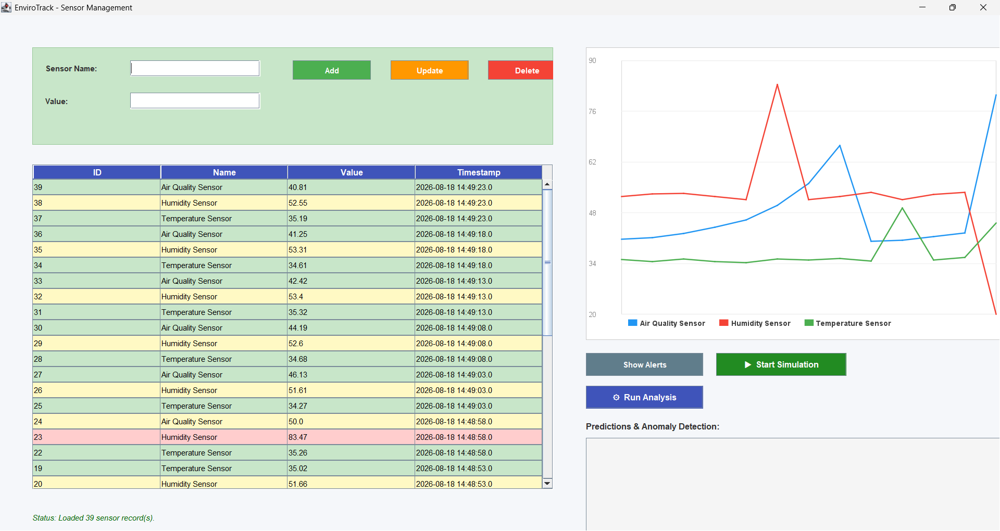

# EnviroTrack

A desktop environmental monitoring system: a Java Swing dashboard backed by a
Python machine-learning layer, reading live sensor data from MySQL.

Temperature, humidity, and air quality readings stream in continuously. The
dashboard plots them, forecasts the next value for each sensor with linear
regression, and flags statistically abnormal readings using z-score analysis.



---

## Why this project

Monitoring systems are easy to build badly. Readings arrive faster than a person
can read them, so the hard parts are not the database writes — they are:

- **Keeping the interface legible while values change constantly.** The layout has
  to stay still even as every number on screen updates.
- **Deciding what counts as abnormal.** A single high reading may be noise; the
  same reading in context may be a fault. That is a statistical question, not a
  threshold question.
- **Keeping historical data queryable** as the table grows by three rows every
  five seconds.

EnviroTrack is my attempt at all three.

---

## Architecture

The Java application owns the interface and the database reads. The Python layer
owns the analysis. Java launches the Python scripts as subprocesses, and the two
sides communicate through MySQL rather than through a socket or an API — the
`predictions` table is the handoff point.

```
┌────────────────────────┐         ┌──────────────────────┐
│  Java Swing (desktop)  │         │  Python (analysis)   │
│                        │         │                      │
│  LoginWindow           │         │  simulator.py        │
│  Main dashboard        │         │  model.py            │
│   ├─ live data table   │         │  anomaly.py          │
│   ├─ custom graph      │         │  analyze.py          │
│   └─ predictions panel │         │                      │
└───────────┬────────────┘         └──────────┬───────────┘
            │                                 │
            │   reads sensors, predictions    │  writes sensors, predictions
            └────────────┬────────────────────┘
                         ▼
                 ┌───────────────┐
                 │    MySQL      │
                 │ envirotrack_db│
                 └───────────────┘
```

Splitting it this way means the analysis can use the Python scientific stack —
scikit-learn, SciPy, pandas — while the interface stays a native desktop app.

---

## What it does

**Live monitoring.** The dashboard auto-refreshes on a timer, showing the latest
reading and location for each sensor.

**Custom-drawn graphing.** The multi-sensor chart is written directly in
`Graphics2D` rather than pulled from a charting library — axis scaling from the
global min/max across all series, gridlines, per-sensor colours, and a legend.

**Next-value prediction.** `model.py` fits a scikit-learn `LinearRegression` over
a sensor's reading history and projects the next value.

**Anomaly detection.** `anomaly.py` computes z-scores across a sensor's recent
readings and flags anything beyond 2.0 standard deviations, with a human-readable
reason stored alongside the flag.

**Realistic data simulation.** With no physical hardware attached, `simulator.py`
generates plausible readings rather than random numbers: temperature follows a
diurnal curve peaking mid-afternoon, humidity moves inversely to it, and air
quality stays stable with occasional pollution spikes.

**Authentication.** Login is validated against the `users` table using
parameterised queries, run on a `SwingWorker` so the UI never blocks.

---

## Tech stack

| Layer | Built with |
|---|---|
| Desktop UI | Java, Swing, Graphics2D |
| Analysis | Python, scikit-learn, SciPy, NumPy, pandas |
| Database | MySQL 8 |
| Connectivity | JDBC (MySQL Connector/J 9.7), PyMySQL |

---

## Getting it running

### Requirements

- JDK 17 or newer
- Python 3.10 or newer
- MySQL 8, running locally

### 1. Clone

```bash
git clone https://github.com/Rishitha333/EnviroTrack.git
cd EnviroTrack
```

### 2. Create the database

```bash
mysql -u root -p < backend.sql
```

This creates `envirotrack_db` with four tables (`sensors`, `predictions`,
`alerts`, `users`), seeds a few readings, and adds a default login of
**`admin` / `1234`**.

### 3. Configure your credentials

Credentials are read from local config files that are **not** committed. Copy the
templates and fill in your own MySQL password:

```bash
cp db.properties.example db.properties     # used by the Java side
cp .env.example .env                       # used by the Python side
```

Environment variables take priority over these files if you would rather use
them: `ENVIROTRACK_DB_USER`, `ENVIROTRACK_DB_PASSWORD`, `ENVIROTRACK_DB_HOST`,
`ENVIROTRACK_DB_NAME`.

### 4. Install the Python dependencies

```bash
cd EnviroTrack/python
pip install -r requirements.txt
pip install python-dotenv        # so the .env file is picked up
```

### 5. Start generating data

```bash
python simulator.py
```

Leave this running. It writes three readings every five seconds and updates each
sensor's prediction and anomaly flag as it goes.

### 6. Launch the dashboard

From the repository root:

```bash
javac -cp "EnviroTrack/lib/mysql-connector-j-9.7.0.jar" -d EnviroTrack/bin EnviroTrack/src/com/envirotrack/*.java
java -cp "EnviroTrack/bin:EnviroTrack/lib/mysql-connector-j-9.7.0.jar" com.envirotrack.LoginWindow
```

On Windows, use `;` instead of `:` as the classpath separator.

Log in with `admin` / `1234`.

> Run from the repository root, not from inside `src/`. The application looks for
> `db.properties` in the current directory and one level up.

### Optional: batch analysis

`analyze.py` recalculates predictions and anomalies for every sensor across its
full history, rather than the rolling window the simulator uses:

```bash
python analyze.py
```

---

## Project layout

```
backend.sql                     database schema and seed data
db.properties.example           Java config template
.env.example                    Python config template
EnviroTrack/
  lib/                          MySQL Connector/J (committed — no build tool yet)
  src/com/envirotrack/
    LoginWindow.java            authentication screen
    Main.java                   dashboard, table, graph, predictions panel
    DBConnection.java           connection factory, credentials from env or file
    Sensor.java                 reading model
  python/
    simulator.py                generates readings, rolling anomaly check
    model.py                    linear regression forecast
    anomaly.py                  z-score anomaly detection
    analyze.py                  full-history batch analysis
    db_config.py                shared connection helper
    requirements.txt
```

---

## Known limitations

Being straightforward about what is not finished:

- **Passwords are stored in plaintext** in the `users` table. Hashing with BCrypt
  is the next planned change.
- **The Start Simulation button is Windows-only.** It invokes the `py` launcher
  with backslash paths, so on macOS and Linux you must run `simulator.py` from a
  terminal instead.
- **The dashboard uses absolute positioning,** so it expects a display wider than
  roughly 1550 px. A layout manager is needed.
- **Prediction and anomaly logic is duplicated.** `simulator.py` contains its own
  inline versions rather than importing `model.py` and `anomaly.py`, and the two
  implementations do not agree. Consolidating them is on the list.
- **The `alerts` table is unused.** Alerts currently live in memory and are lost
  when the app closes.
- **No build tool.** The MySQL connector is committed as a jar and the classpath
  is managed by hand. Migrating to Maven would make this reproducible.

---

## Roadmap

- [ ] BCrypt password hashing
- [ ] Cross-platform subprocess launching
- [ ] Replace absolute positioning with layout managers
- [ ] Consolidate the duplicated analysis logic
- [ ] Persist alerts to the database
- [ ] Migrate the build to Maven
- [ ] Read from real hardware sensors over serial or MQTT

---

## Licence

MIT — see [LICENSE](LICENSE).

---

Built by **Rishitha Galicherla** ·
[GitHub](https://github.com/Rishitha333) ·
[LinkedIn](https://www.linkedin.com/in/rishitha-galicherla-363487227/)